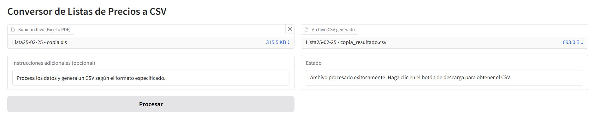

# Formateador de listas de precios con IA para sistema AdmGlobal

Esta herramienta permite convertir listas de precios de proveedores que estén en formato PDF y Excel al
formato CSV por el sistema AdmGlobal, se utiliza el modelo Claude Sonnet 3.7 de Anthropic.
Este proyecto es del tipo académico y cuanta con un bajo nivel de QA, tener en cuanta que muchos escenarios 
pueden no estar contemplados. 

## Requisitos

- Python 3.8 o superior
- Una clave API de Anthropic

## Instalación

1. Clona este repositorio o descarga los archivos

2. Crea un entorno virtual (recomendado):
```bash
python -m venv venv
source venv/bin/activate  # En Linux/Mac
venv\Scripts\activate     # En Windows
```

3. Instala las dependencias:
```bash
pip install -r requirements.txt
```

4. Crea un archivo `.env` en el directorio raíz y añade tu clave API de Anthropic:
```
ANTHROPIC_API_KEY=tu_clave_api_aquí
```

## Uso

1. Ejecuta la aplicación:
```bash
python app.py
```

2. Se abre tu navegador web en la dirección que aparece en la consola (generalmente http://localhost:7860)

3. En la interfaz web:
   - Sube tu archivo PDF o Excel
   - Ingresa el prompt template que define cómo se deben procesar los datos
   - Haz clic en "Submit"

4. La herramienta procesará el archivo y generará un archivo csv con la salida

## Formatos soportados

- PDF (.pdf)
- Excel (.xlsx, .xls)




